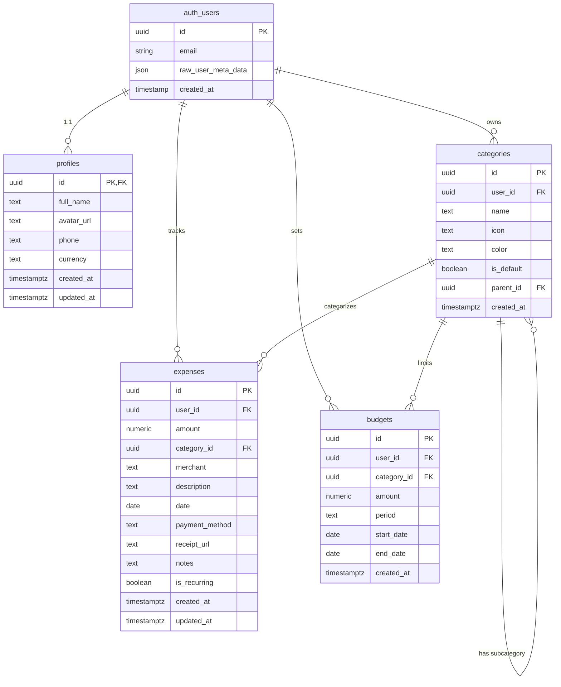

# Database Schema - FundVance AI

**Last Updated:** February 11, 2026  
**Database:** PostgreSQL 15 (Supabase)  
**Project:** FundVanceAI (vczxtjxerczfisubjlff)

---

## 📊 Entity Relationship Diagram



---

## 📋 Table Definitions

### 1. **profiles**
User profile information linked to Supabase authentication.

| Column | Type | Constraints | Description |
|--------|------|-------------|-------------|
| `id` | UUID | PRIMARY KEY, REFERENCES auth.users | User ID from Supabase Auth |
| `full_name` | TEXT | - | User's full name |
| `avatar_url` | TEXT | - | Profile picture URL |
| `phone` | TEXT | - | Phone number |
| `currency` | TEXT | DEFAULT 'USD' | Preferred currency code |
| `created_at` | TIMESTAMPTZ | DEFAULT NOW() | Account creation timestamp |
| `updated_at` | TIMESTAMPTZ | DEFAULT NOW() | Last profile update |

**Relationships:**
- `id` → `auth.users.id` (1:1, CASCADE DELETE)

**Row Level Security (RLS):**
- ✅ Enabled
- `SELECT`: Users can view their own profile (`auth.uid() = id`)
- `UPDATE`: Users can update their own profile (`auth.uid() = id`)

**Triggers:**
- Auto-creates profile when new user signs up via `handle_new_user()` function

---

### 2. **categories**
Expense categories (default system categories + user-custom categories).

| Column | Type | Constraints | Description |
|--------|------|-------------|-------------|
| `id` | UUID | PRIMARY KEY, DEFAULT uuid_generate_v4() | Category unique ID |
| `user_id` | UUID | REFERENCES auth.users, NULL allowed | Owner (NULL = system default) |
| `name` | TEXT | NOT NULL | Category name |
| `icon` | TEXT | - | Emoji icon (e.g., 🍔) |
| `color` | TEXT | - | Hex color code (e.g., #FF6B6B) |
| `is_default` | BOOLEAN | DEFAULT false | System-provided category |
| `parent_id` | UUID | REFERENCES categories(id), CASCADE | Parent category for subcategories |
| `created_at` | TIMESTAMPTZ | DEFAULT NOW() | Creation timestamp |

**Relationships:**
- `user_id` → `auth.users.id` (N:1, CASCADE DELETE)
- `parent_id` → `categories.id` (Self-referencing for subcategories, CASCADE DELETE)

**Indexes:**
- `idx_categories_user_id` on `user_id`
- `idx_categories_parent_id` on `parent_id`

**Row Level Security (RLS):**
- ✅ Enabled
- `SELECT`: Users can view own categories + system defaults (`auth.uid() = user_id OR user_id IS NULL`)
- `ALL`: Users can manage only their own categories (`auth.uid() = user_id`)

**Default Data (11 categories):**
| Name | Icon | Color | Type |
|------|------|-------|------|
| Food | 🍔 | #FF6B6B | Main |
| ├─ Groceries | 🛒 | #FF6B6B | Sub |
| ├─ Dining Out | 🍽️ | #FF6B6B | Sub |
| ├─ Coffee Shops | ☕ | #FF6B6B | Sub |
| └─ Food Delivery | 🍕 | #FF6B6B | Sub |
| Transport | 🚗 | #4ECDC4 | Main |
| Bills | 📄 | #45B7D1 | Main |
| Shopping | 🛍️ | #96CEB4 | Main |
| Entertainment | 🎬 | #FFEAA7 | Main |
| Healthcare | ⚕️ | #DDA15E | Main |
| Others | 📌 | #95A5A6 | Main |

---

### 3. **expenses**
Individual expense transactions tracked by users.

| Column | Type | Constraints | Description |
|--------|------|-------------|-------------|
| `id` | UUID | PRIMARY KEY, DEFAULT uuid_generate_v4() | Expense unique ID |
| `user_id` | UUID | REFERENCES auth.users, NOT NULL | Expense owner |
| `amount` | DECIMAL(10,2) | NOT NULL | Expense amount (e.g., 49.99) |
| `category_id` | UUID | REFERENCES categories, SET NULL | Category assignment |
| `merchant` | TEXT | - | Store/vendor name |
| `description` | TEXT | - | Expense description |
| `date` | DATE | NOT NULL, DEFAULT CURRENT_DATE | Transaction date |
| `payment_method` | TEXT | - | Payment type (cash, card, etc.) |
| `receipt_url` | TEXT | - | Scanned receipt image URL |
| `notes` | TEXT | - | Additional notes |
| `is_recurring` | BOOLEAN | DEFAULT false | Recurring expense flag |
| `created_at` | TIMESTAMPTZ | DEFAULT NOW() | Record creation time |
| `updated_at` | TIMESTAMPTZ | DEFAULT NOW() | Last update time |

**Relationships:**
- `user_id` → `auth.users.id` (N:1, CASCADE DELETE)
- `category_id` → `categories.id` (N:1, SET NULL)

**Indexes:**
- `idx_expenses_user_id` on `user_id`
- `idx_expenses_date` on `date`
- `idx_expenses_category_id` on `category_id`
- `idx_expenses_user_date` on `(user_id, date DESC)` - Optimized for user timeline queries

**Row Level Security (RLS):**
- ✅ Enabled
- `SELECT`: Users view only their expenses (`auth.uid() = user_id`)
- `INSERT`: Users can only insert their own expenses (`auth.uid() = user_id`)
- `UPDATE`: Users can only update their own expenses (`auth.uid() = user_id`)
- `DELETE`: Users can only delete their own expenses (`auth.uid() = user_id`)

---

### 4. **budgets**
Budget limits set by users for spending control.

| Column | Type | Constraints | Description |
|--------|------|-------------|-------------|
| `id` | UUID | PRIMARY KEY, DEFAULT uuid_generate_v4() | Budget unique ID |
| `user_id` | UUID | REFERENCES auth.users, NOT NULL | Budget owner |
| `category_id` | UUID | REFERENCES categories, CASCADE | Category to budget |
| `amount` | DECIMAL(10,2) | NOT NULL | Budget limit amount |
| `period` | TEXT | NOT NULL, CHECK IN ('weekly', 'monthly', 'yearly') | Budget period |
| `start_date` | DATE | NOT NULL | Budget start date |
| `end_date` | DATE | - | Budget end date (NULL = ongoing) |
| `created_at` | TIMESTAMPTZ | DEFAULT NOW() | Creation timestamp |

**Relationships:**
- `user_id` → `auth.users.id` (N:1, CASCADE DELETE)
- `category_id` → `categories.id` (N:1, CASCADE DELETE)

**Indexes:**
- `idx_budgets_user_id` on `user_id`
- `idx_budgets_category_id` on `category_id`

**Row Level Security (RLS):**
- ✅ Enabled
- `ALL`: Users can fully manage their own budgets (`auth.uid() = user_id`)

**Valid Period Values:**
- `weekly` - 7-day budget cycle
- `monthly` - Monthly budget cycle
- `yearly` - Annual budget cycle

---

## 🔐 Security Features

### Row Level Security (RLS)
All tables have RLS enabled to ensure data isolation between users:

| Table | Policy | Rule |
|-------|--------|------|
| profiles | View/Update | Own profile only |
| categories | View | Own + system defaults (user_id IS NULL) |
| categories | Manage | Own categories only |
| expenses | Full CRUD | Own expenses only |
| budgets | Full CRUD | Own budgets only |

### Authentication Integration
- All user tables reference `auth.users(id)` from Supabase Auth
- Auto-profile creation via database trigger on signup
- JWT-based authentication enforced by Supabase

---

## 🔄 Database Triggers

### `handle_new_user()`
**Purpose:** Automatically create user profile when new user signs up

**Trigger:** `on_auth_user_created` (AFTER INSERT on auth.users)

**Logic:**
```sql
INSERT INTO profiles (id, full_name)
VALUES (NEW.id, NEW.raw_user_meta_data->>'full_name')
```

---

## 📈 Performance Optimizations

### Indexes Created
1. **categories table:**
   - `idx_categories_user_id` - Fast user category lookups
   - `idx_categories_parent_id` - Efficient subcategory queries

2. **expenses table:**
   - `idx_expenses_user_id` - User expense filtering
   - `idx_expenses_date` - Date range queries
   - `idx_expenses_category_id` - Category-based filtering
   - `idx_expenses_user_date` - Composite index for user timeline (DESC order)

3. **budgets table:**
   - `idx_budgets_user_id` - User budget lookups
   - `idx_budgets_category_id` - Category budget queries

### Query Optimization Tips
- Use composite index `idx_expenses_user_date` for recent expenses: 
  ```sql
  SELECT * FROM expenses 
  WHERE user_id = $1 
  ORDER BY date DESC 
  LIMIT 20
  ```
- Category filtering leverages `idx_expenses_category_id`
- Date range queries use `idx_expenses_date`

---

## 🛠️ Common Queries

### Get User's Recent Expenses
```sql
SELECT e.*, c.name as category_name, c.icon
FROM expenses e
LEFT JOIN categories c ON e.category_id = c.id
WHERE e.user_id = auth.uid()
ORDER BY e.date DESC
LIMIT 10;
```

### Get Monthly Spending by Category
```sql
SELECT 
  c.name,
  SUM(e.amount) as total_spent,
  COUNT(*) as transaction_count
FROM expenses e
JOIN categories c ON e.category_id = c.id
WHERE e.user_id = auth.uid()
  AND e.date >= DATE_TRUNC('month', CURRENT_DATE)
GROUP BY c.name
ORDER BY total_spent DESC;
```

### Check Budget vs Actual Spending
```sql
SELECT 
  b.amount as budget_amount,
  COALESCE(SUM(e.amount), 0) as spent_amount,
  b.amount - COALESCE(SUM(e.amount), 0) as remaining,
  c.name as category_name
FROM budgets b
LEFT JOIN expenses e ON e.category_id = b.category_id 
  AND e.user_id = b.user_id
  AND e.date BETWEEN b.start_date AND COALESCE(b.end_date, CURRENT_DATE)
LEFT JOIN categories c ON b.category_id = c.id
WHERE b.user_id = auth.uid()
  AND b.period = 'monthly'
  AND b.start_date <= CURRENT_DATE
  AND (b.end_date IS NULL OR b.end_date >= CURRENT_DATE)
GROUP BY b.id, b.amount, c.name;
```

### Get All Categories (System + User Custom)
```sql
SELECT * FROM categories
WHERE user_id IS NULL OR user_id = auth.uid()
ORDER BY is_default DESC, name ASC;
```

---

## 📊 Database Statistics

**Total Tables:** 4  
**Total Indexes:** 8  
**RLS Policies:** 11  
**Database Triggers:** 1  
**Default Categories:** 11 (7 main + 4 subcategories)

---

## 🔗 Quick Links

- **Supabase Dashboard:** https://supabase.com/dashboard/project/vczxtjxerczfisubjlff
- **Table Editor:** https://supabase.com/dashboard/project/vczxtjxerczfisubjlff/editor
- **SQL Editor:** https://supabase.com/dashboard/project/vczxtjxerczfisubjlff/sql
- **Database Settings:** https://supabase.com/dashboard/project/vczxtjxerczfisubjlff/settings/database

---

## 📝 Migration History

| Date | Version | Changes |
|------|---------|---------|
| Feb 11, 2026 | 1.0 | Initial schema creation - profiles, categories, expenses, budgets |

---

**Next Steps:**
- ✅ Database schema created
- ⏳ Create Flutter project
- ⏳ Implement Supabase authentication
- ⏳ Build expense CRUD operations
