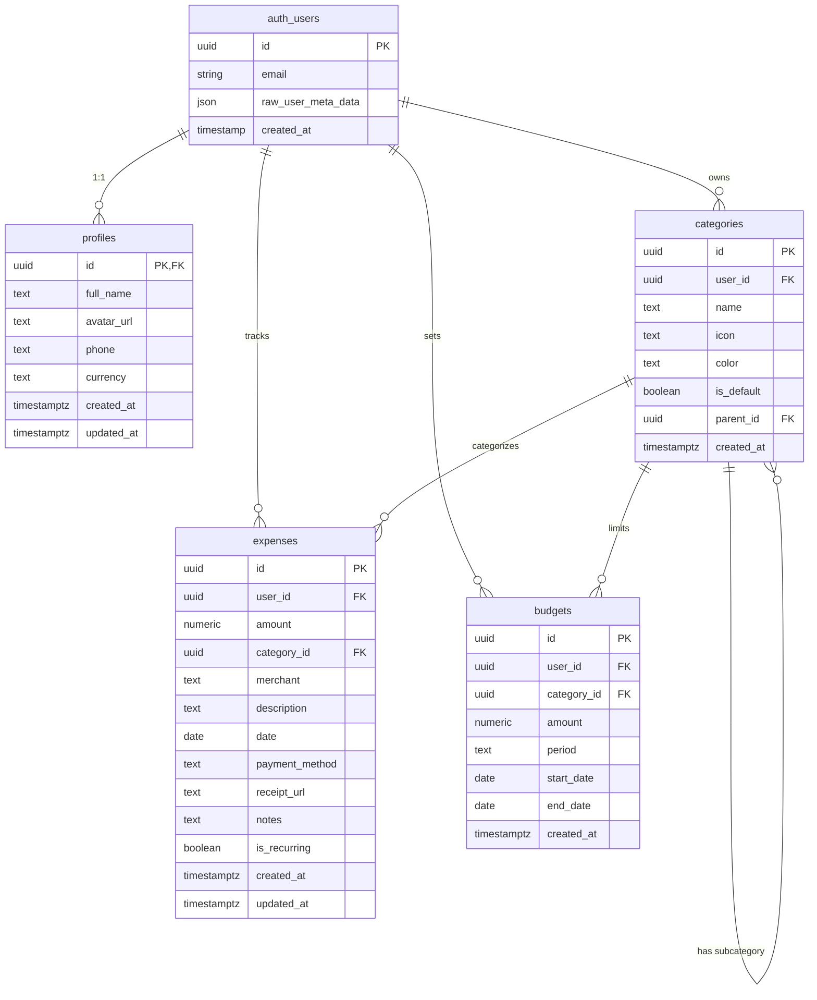

# Database Schema - FundVance AI

**Last Updated:** February 25, 2026  
**Database:** PostgreSQL 15 (Supabase)  
**Project:** FundVanceAI (vczxtjxerczfisubjlff)  
**Migrations:** 33 sequential migrations (001-033)

---

## 📊 Entity Relationship Diagram



---

## 📋 Table Definitions

### 1. **profiles**
User profile information linked to Supabase authentication.

| Column | Type | Constraints | Description |
|--------|------|-------------|-------------|
| `id` | UUID | PRIMARY KEY, REFERENCES auth.users | User ID from Supabase Auth |
| `full_name` | TEXT | - | User's full name |
| `avatar_url` | TEXT | - | Profile picture URL |
| `phone` | TEXT | - | Phone number |
| `currency` | TEXT | DEFAULT 'USD' | Preferred currency code |
| `created_at` | TIMESTAMPTZ | DEFAULT NOW() | Account creation timestamp |
| `updated_at` | TIMESTAMPTZ | DEFAULT NOW() | Last profile update |

**Relationships:**
- `id` → `auth.users.id` (1:1, CASCADE DELETE)

**Row Level Security (RLS):**
- ✅ Enabled
- `SELECT`: Users can view their own profile (`auth.uid() = id`)
- `UPDATE`: Users can update their own profile (`auth.uid() = id`)

**Triggers:**
- Auto-creates profile when new user signs up via `handle_new_user()` function

---

### 2. **categories**
Expense categories (default system categories + user-custom categories).

| Column | Type | Constraints | Description |
|--------|------|-------------|-------------|
| `id` | UUID | PRIMARY KEY, DEFAULT uuid_generate_v4() | Category unique ID |
| `user_id` | UUID | REFERENCES auth.users, NULL allowed | Owner (NULL = system default) |
| `name` | TEXT | NOT NULL | Category name |
| `icon` | TEXT | - | Emoji icon (e.g., 🍔) |
| `color` | TEXT | - | Hex color code (e.g., #FF6B6B) |
| `is_default` | BOOLEAN | DEFAULT false | System-provided category |
| `parent_id` | UUID | REFERENCES categories(id), CASCADE | Parent category for subcategories |
| `created_at` | TIMESTAMPTZ | DEFAULT NOW() | Creation timestamp |

**Relationships:**
- `user_id` → `auth.users.id` (N:1, CASCADE DELETE)
- `parent_id` → `categories.id` (Self-referencing for subcategories, CASCADE DELETE)

**Indexes:**
- `idx_categories_user_id` on `user_id`
- `idx_categories_parent_id` on `parent_id`

**Row Level Security (RLS):**
- ✅ Enabled
- `SELECT`: Users can view own categories + system defaults (`auth.uid() = user_id OR user_id IS NULL`)
- `ALL`: Users can manage only their own categories (`auth.uid() = user_id`)

**Default Data (11 categories):**
| Name | Icon | Color | Type |
|------|------|-------|------|
| Food | 🍔 | #FF6B6B | Main |
| ├─ Groceries | 🛒 | #FF6B6B | Sub |
| ├─ Dining Out | 🍽️ | #FF6B6B | Sub |
| ├─ Coffee Shops | ☕ | #FF6B6B | Sub |
| └─ Food Delivery | 🍕 | #FF6B6B | Sub |
| Transport | 🚗 | #4ECDC4 | Main |
| Bills | 📄 | #45B7D1 | Main |
| Shopping | 🛍️ | #96CEB4 | Main |
| Entertainment | 🎬 | #FFEAA7 | Main |
| Healthcare | ⚕️ | #DDA15E | Main |
| Others | 📌 | #95A5A6 | Main |

---

### 3. **expenses**
Individual expense transactions tracked by users.

| Column | Type | Constraints | Description |
|--------|------|-------------|-------------|
| `id` | UUID | PRIMARY KEY, DEFAULT uuid_generate_v4() | Expense unique ID |
| `user_id` | UUID | REFERENCES auth.users, NOT NULL | Expense owner |
| `amount` | DECIMAL(10,2) | NOT NULL | Expense amount (e.g., 49.99) |
| `category_id` | UUID | REFERENCES categories, SET NULL | Category assignment |
| `merchant` | TEXT | - | Store/vendor name |
| `description` | TEXT | - | Expense description |
| `date` | DATE | NOT NULL, DEFAULT CURRENT_DATE | Transaction date |
| `payment_method` | TEXT | - | Payment type (cash, card, etc.) |
| `receipt_url` | TEXT | - | Scanned receipt image URL |
| `notes` | TEXT | - | Additional notes |
| `is_recurring` | BOOLEAN | DEFAULT false | Recurring expense flag |
| `created_at` | TIMESTAMPTZ | DEFAULT NOW() | Record creation time |
| `updated_at` | TIMESTAMPTZ | DEFAULT NOW() | Last update time |

**Relationships:**
- `user_id` → `auth.users.id` (N:1, CASCADE DELETE)
- `category_id` → `categories.id` (N:1, SET NULL)

**Indexes:**
- `idx_expenses_user_id` on `user_id`
- `idx_expenses_date` on `date`
- `idx_expenses_category_id` on `category_id`
- `idx_expenses_user_date` on `(user_id, date DESC)` - Optimized for user timeline queries

**Row Level Security (RLS):**
- ✅ Enabled
- `SELECT`: Users view only their expenses (`auth.uid() = user_id`)
- `INSERT`: Users can only insert their own expenses (`auth.uid() = user_id`)
- `UPDATE`: Users can only update their own expenses (`auth.uid() = user_id`)
- `DELETE`: Users can only delete their own expenses (`auth.uid() = user_id`)

---

### 4. **budgets**
Budget limits set by users for spending control.

| Column | Type | Constraints | Description |
|--------|------|-------------|-------------|
| `id` | UUID | PRIMARY KEY, DEFAULT uuid_generate_v4() | Budget unique ID |
| `user_id` | UUID | REFERENCES auth.users, NOT NULL | Budget owner |
| `category_id` | UUID | REFERENCES categories, CASCADE | Category to budget |
| `amount` | DECIMAL(10,2) | NOT NULL | Budget limit amount |
| `period` | TEXT | NOT NULL, CHECK IN ('weekly', 'monthly', 'yearly') | Budget period |
| `start_date` | DATE | NOT NULL | Budget start date |
| `end_date` | DATE | - | Budget end date (NULL = ongoing) |
| `created_at` | TIMESTAMPTZ | DEFAULT NOW() | Creation timestamp |

**Relationships:**
- `user_id` → `auth.users.id` (N:1, CASCADE DELETE)
- `category_id` → `categories.id` (N:1, CASCADE DELETE)

**Indexes:**
- `idx_budgets_user_id` on `user_id`
- `idx_budgets_category_id` on `category_id`

**Row Level Security (RLS):**
- ✅ Enabled
- `ALL`: Users can fully manage their own budgets (`auth.uid() = user_id`)

**Valid Period Values:**
- `weekly` - 7-day budget cycle
- `monthly` - Monthly budget cycle
- `yearly` - Annual budget cycle

---

## 🔐 Security Features

### Row Level Security (RLS)
All tables have RLS enabled to ensure data isolation between users:

| Table | Policy | Rule |
|-------|--------|------|
| profiles | View/Update | Own profile only |
| categories | View | Own + system defaults (user_id IS NULL) |
| categories | Manage | Own categories only |
| expenses | Full CRUD | Own expenses only |
| budgets | Full CRUD | Own budgets only |

### Authentication Integration
- All user tables reference `auth.users(id)` from Supabase Auth
- Auto-profile creation via database trigger on signup
- JWT-based authentication enforced by Supabase

---

## 🔄 Database Triggers

### `handle_new_user()`
**Purpose:** Automatically create user profile when new user signs up

**Trigger:** `on_auth_user_created` (AFTER INSERT on auth.users)

**Logic:**
```sql
INSERT INTO profiles (id, full_name)
VALUES (NEW.id, NEW.raw_user_meta_data->>'full_name')
```

---

## 📈 Performance Optimizations

### Indexes Created
1. **categories table:**
   - `idx_categories_user_id` - Fast user category lookups
   - `idx_categories_parent_id` - Efficient subcategory queries

2. **expenses table:**
   - `idx_expenses_user_id` - User expense filtering
   - `idx_expenses_date` - Date range queries
   - `idx_expenses_category_id` - Category-based filtering
   - `idx_expenses_user_date` - Composite index for user timeline (DESC order)

3. **budgets table:**
   - `idx_budgets_user_id` - User budget lookups
   - `idx_budgets_category_id` - Category budget queries

### Query Optimization Tips
- Use composite index `idx_expenses_user_date` for recent expenses: 
  ```sql
  SELECT * FROM expenses 
  WHERE user_id = $1 
  ORDER BY date DESC 
  LIMIT 20
  ```
- Category filtering leverages `idx_expenses_category_id`
- Date range queries use `idx_expenses_date`

---

## 🛠️ Common Queries

### Get User's Recent Expenses
```sql
SELECT e.*, c.name as category_name, c.icon
FROM expenses e
LEFT JOIN categories c ON e.category_id = c.id
WHERE e.user_id = auth.uid()
ORDER BY e.date DESC
LIMIT 10;
```

### Get Monthly Spending by Category
```sql
SELECT 
  c.name,
  SUM(e.amount) as total_spent,
  COUNT(*) as transaction_count
FROM expenses e
JOIN categories c ON e.category_id = c.id
WHERE e.user_id = auth.uid()
  AND e.date >= DATE_TRUNC('month', CURRENT_DATE)
GROUP BY c.name
ORDER BY total_spent DESC;
```

### Check Budget vs Actual Spending
```sql
SELECT 
  b.amount as budget_amount,
  COALESCE(SUM(e.amount), 0) as spent_amount,
  b.amount - COALESCE(SUM(e.amount), 0) as remaining,
  c.name as category_name
FROM budgets b
LEFT JOIN expenses e ON e.category_id = b.category_id 
  AND e.user_id = b.user_id
  AND e.date BETWEEN b.start_date AND COALESCE(b.end_date, CURRENT_DATE)
LEFT JOIN categories c ON b.category_id = c.id
WHERE b.user_id = auth.uid()
  AND b.period = 'monthly'
  AND b.start_date <= CURRENT_DATE
  AND (b.end_date IS NULL OR b.end_date >= CURRENT_DATE)
GROUP BY b.id, b.amount, c.name;
```

### Get All Categories (System + User Custom)
```sql
SELECT * FROM categories
WHERE user_id IS NULL OR user_id = auth.uid()
ORDER BY is_default DESC, name ASC;
```

---

## 5. **account_types**
Predefined account types for categorizing financial accounts.

| Column | Type | Constraints | Description |
|--------|------|-------------|-------------|
| `id` | UUID | PRIMARY KEY, DEFAULT gen_random_uuid() | Account type unique ID |
| `code` | VARCHAR(20) | NOT NULL, UNIQUE | Account type code (e.g., CHECKING, PAYPAL) |
| `name` | VARCHAR(100) | NOT NULL | Account type display name |
| `description` | TEXT | - | Account type description |
| `icon` | VARCHAR(50) | NOT NULL | Material icon name |
| `color` | VARCHAR(7) | NOT NULL | Hex color code (e.g., #4CAF50) |
| `category` | VARCHAR(20) | NOT NULL, CHECK IN (...) | Account category classification |
| `is_active` | BOOLEAN | DEFAULT true | Whether type is available |
| `created_at` | TIMESTAMPTZ | DEFAULT NOW() | Creation timestamp |
| `updated_at` | TIMESTAMPTZ | DEFAULT NOW() | Last update timestamp |

**Category Values:**
- `bank` - Traditional bank accounts (Checking, Savings)
- `online_bank` - Digital-only banks
- `e_wallet` - Digital wallets (PayPal, GCash, Apple Pay, Google Pay)
- `credit` - Credit accounts (Credit Card, Line of Credit)
- `cash` - Physical cash
- `crypto` - Cryptocurrency wallets
- `investment` - Investment accounts

**Row Level Security (RLS):**
- ✅ Enabled
- `SELECT`: All authenticated users can view active account types

**Default Data (12 types across 7 categories):**
| Code | Name | Category | Icon | Color |
|------|------|----------|------|-------|
| CHECKING | Checking Account | bank | account_balance_wallet | #4CAF50 |
| SAVINGS | Savings Account | bank | savings | #2196F3 |
| ONLINE_BANK | Online Bank | online_bank | computer | #00BCD4 |
| PAYPAL | PayPal | e_wallet | account_balance_wallet | #003087 |
| APPLE_PAY | Apple Pay | e_wallet | apple | #000000 |
| GOOGLE_PAY | Google Pay | e_wallet | account_balance_wallet | #4285F4 |
| GCASH | GCash | e_wallet | phone | #007FFF |
| CREDIT_CARD | Credit Card | credit | credit_card | #F44336 |
| LINE_OF_CREDIT | Line of Credit | credit | line_style | #FF5722 |
| CASH | Cash | cash | attach_money | #4CAF50 |
| CRYPTO_WALLET | Crypto Wallet | crypto | currency_bitcoin | #FF9800 |
| INVESTMENT | Investment Account | investment | trending_up | #4CAF50 |

---

## 6. **accounts**
User's financial accounts (bank accounts, wallets, credit cards, etc.)

| Column | Type | Constraints | Description |
|--------|------|-------------|-------------|
| `id` | UUID | PRIMARY KEY, DEFAULT gen_random_uuid() | Account unique ID |
| `user_id` | UUID | REFERENCES auth.users, NOT NULL | Account owner |
| `account_type_id` | UUID | REFERENCES account_types, NOT NULL | Account type reference |
| `name` | VARCHAR(255) | NOT NULL | User-defined account name |
| `description` | TEXT | - | Account description |
| `currency` | VARCHAR(3) | NOT NULL, DEFAULT 'USD' | Account currency code |
| `initial_balance` | DECIMAL(15,2) | DEFAULT 0 | Starting balance |
| `current_balance` | DECIMAL(15,2) | DEFAULT 0 | Current balance (auto-updated) |
| `available_balance` | DECIMAL(15,2) | DEFAULT 0 | Available balance (current - credit used) |
| `institution_name` | VARCHAR(255) | - | Bank/institution name |
| `account_nickname` | VARCHAR(100) | - | Friendly nickname |
| `credit_limit` | DECIMAL(15,2) | - | Credit limit (for credit accounts) |
| `credit_used` | DECIMAL(15,2) | DEFAULT 0 | Credit currently used |
| `is_active` | BOOLEAN | DEFAULT true | Account active status |
| `include_in_total` | BOOLEAN | DEFAULT true | Include in net worth calculation |
| `is_hidden` | BOOLEAN | DEFAULT false | Hide from main view |
| `account_settings` | JSONB | - | Additional settings |
| `last_transaction_date` | TIMESTAMPTZ | - | Last transaction timestamp |
| `created_at` | TIMESTAMPTZ | DEFAULT NOW() | Creation timestamp |
| `updated_at` | TIMESTAMPTZ | DEFAULT NOW() | Last update timestamp |
| `deleted_at` | TIMESTAMPTZ | NULL | Soft delete timestamp |

**Relationships:**
- `user_id` → `auth.users.id` (N:1, CASCADE DELETE)
- `account_type_id` → `account_types.id` (N:1, RESTRICT)

**Indexes:**
- `idx_accounts_user_id` on `user_id`
- `idx_accounts_type_id` on `account_type_id`
- `idx_accounts_active` on `is_active`
- `idx_accounts_deleted_at` on `deleted_at`
- `idx_accounts_last_transaction` on `last_transaction_date`

**Row Level Security (RLS):**
- ✅ Enabled
- `SELECT`: Users view only active accounts (`auth.uid() = user_id AND deleted_at IS NULL`)
- `INSERT`: Users can create own accounts (`auth.uid() = user_id`)
- `UPDATE`: Users can update own accounts (`auth.uid() = user_id`)
- `DELETE`: Users can delete own accounts (`auth.uid() = user_id`)

**Automatic Features:**
- **Auto-creation on signup:** All 12 account types created automatically when user signs up
- **Dynamic currency:** Accounts inherit user's profile currency by default
- **Smart currency updates:** When profile currency changes, only accounts matching old currency are updated
- **Balance tracking:** Balances auto-update on expense/income transactions

---

## 📊 Database Statistics

**Total Tables:** 22+ (profiles, categories, expenses, budgets, accounts, account_types, income, income_categories, transfers, transfer_categories, taxes, tax_presets, goals, goal_contributions, debts, debt_payments, recurring_schedules, merchant_category_overrides, ...)  
**Total Indexes:** 40+  
**RLS Policies:** 40+  
**Database Triggers:** 5+ (handle_new_user, create_default_accounts, update_account_currencies, ...)  
**Database Functions:** 10+ (account balance management, total calculations, goal/debt triggers)  
**Default Categories:** 21+ (expense, income, transfer)  
**Default Account Types:** 12 (across 7 categories)  
**Migrations:** 33 sequential migrations (001-033)

---

## 🔗 Quick Links

- **Supabase Dashboard:** https://supabase.com/dashboard/project/vczxtjxerczfisubjlff
- **Table Editor:** https://supabase.com/dashboard/project/vczxtjxerczfisubjlff/editor
- **SQL Editor:** https://supabase.com/dashboard/project/vczxtjxerczfisubjlff/sql
- **Database Settings:** https://supabase.com/dashboard/project/vczxtjxerczfisubjlff/settings/database

---

## 📝 Migration History

| Date | Migration | Changes |
|------|-----------|---------|
| Feb 12, 2026 | 001 | UUID extension (gen_random_uuid) |
| Feb 12, 2026 | 002 | Profiles table with auto-creation trigger and INSERT policy |
| Feb 12, 2026 | 003 | Categories table (expense, income, both types) |
| Feb 12, 2026 | 004 | Expenses table with soft delete |
| Feb 12, 2026 | 005 | Budgets table with period constraints |
| Feb 12, 2026 | 006 | Income system (income, income_categories tables) |
| Feb 12, 2026 | 007 | Account system (accounts, account_types with 7 categories) |
| Feb 12, 2026 | 008 | Transfer system (transfers, transfer_categories) |
| Feb 12, 2026 | 009 | Tax system (taxes, tax_presets for PH/USA/WLD) |
| Feb 12, 2026 | 010 | Enhanced categories table (is_default, description, sort_order) |
| Feb 12, 2026 | 011 | Add account_id to expenses table |
| Feb 12, 2026 | 012 | Auto-create default accounts + smart currency update triggers |
| Feb 2026 | 013–020 | Income categories, tax presets (PH/USA/WLD), category enhancements, recurring fields |
| Feb 2026 | 021–025 | Goals + goal_contributions (RLS, triggers, soft-delete) |
| Feb 2026 | 026–030 | Debts + debt_payments (RLS, triggers, snowball/avalanche fields) |
| Feb 2026 | 031 | Personalization — merchant_category_overrides table (RLS + index) |
| Feb 2026 | 032 | Enhanced categories (description, sort_order, is_default) |
| Feb 25, 2026 | 033 | Budget carry-forward (carry_forward_amount column on budgets) |

---

**Key Features Implemented:**
- ✅ Row Level Security (RLS) on all tables
- ✅ Soft delete system with deleted_at timestamps
- ✅ Auto-profile creation on user signup
- ✅ Auto-account creation (12 accounts per user)
- ✅ Dynamic currency system (profile default, smart account updates)
- ✅ Category-based account organization (7 categories)
- ✅ Comprehensive seeder data (21 categories, 12 account types, 18 tax presets)
- ✅ PostgreSQL 13+ compatibility (gen_random_uuid)

**Implemented Post-012 (Migrations 013-033):**
- ✅ Per-account currency override
- ✅ Account soft-delete and restore (DeletedAccountsScreen)
- ✅ Recurring transactions (recurring_frequency field + RecurringSchedulerService)
- ✅ Goals system (goals + goal_contributions tables, RLS, triggers)
- ✅ Debt payoff system (debts + debt_payments tables, RLS, triggers)
- ✅ Subscription detection (via SmartInsightsService, no separate table)
- ✅ Personalization engine (merchant_category_overrides table)
- ✅ Budget carry-forward (carry_forward_amount column on budgets)
- ✅ Receipt OCR metadata (receipt_url on expenses — already existed)
- ☐ Receipt image storage (Supabase Storage — OCR result saved, image not stored)

---
